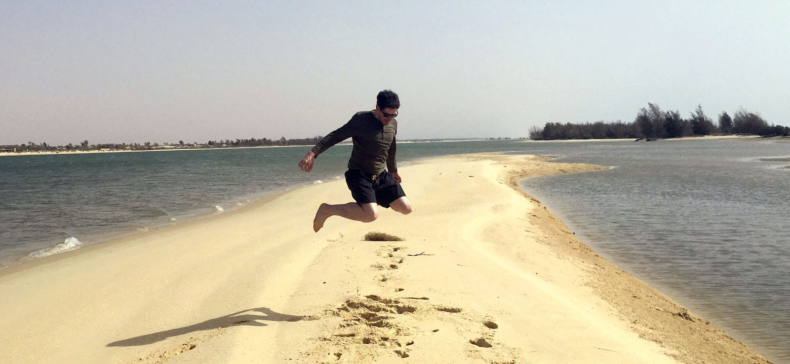

Hi I'm Nicolas. I have been doing software developement for over 13 years and love beautiful & easy to use interfaces. I like to experiment with new APIs and frameworks. I created lots of small demos and applications which you will find in this space. Amongst them is [AthenaJS](https://athenajs.github.io) a framework for creating 2D games and [React-Explorer](https://github.com/warpdesign/react-explorer), a file explorer written in TypeScript with React and blueprintjs.

I work at [Leboncoin](https://leboncoin.fr) as a Frontend Software Engineer. For more information about me checkout [warpdesign.fr](https://warpdesign.fr)
